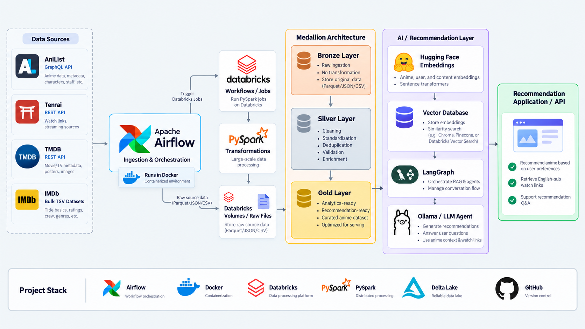

# Anime Data Platform

## Overview

This is Day 2 of my Databricks & AI project. The AI component is not implemented yet, as I am currently focusing on applying good data lakehouse practices and building a solid data engineering foundation first.

Anime Data Platform is an end-to-end data engineering and AI project that ingests anime data from multiple sources, processes the data using Databricks and the Medallion Architecture, and prepares curated datasets for an AI-powered anime recommendation and watch-link application.

The project combines traditional data engineering with AI by using:

- Apache Airflow for orchestration
- Databricks for distributed data processing
- PySpark for transformation
- Delta Lake for reliable storage
- Unity Catalog for data organization and governance
- SQL for structured recommendation queries
- Vector search for semantic recommendations
- LangGraph for AI agent orchestration
- A local LLM through Ollama or Llama
- Current streaming availability lookup for English-subbed viewing options

The main idea is to build a reliable data platform first, then use the curated data as the foundation for an AI recommendation system.

---

# Project Motivation

I created this project because anime with english subtitles are often taken down or the video is loading too slow.

## Project Architecture

## Data Flow
